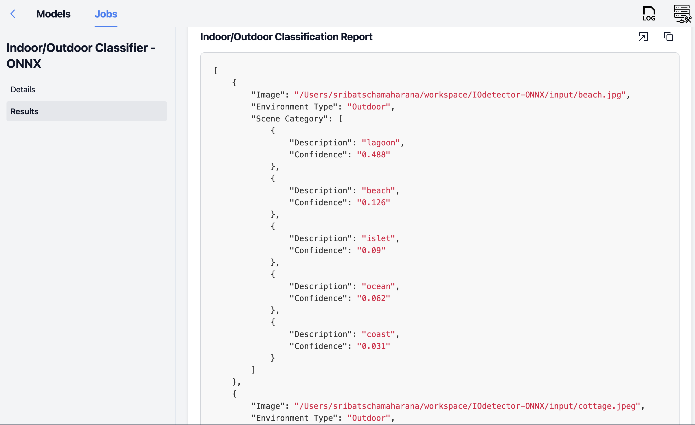
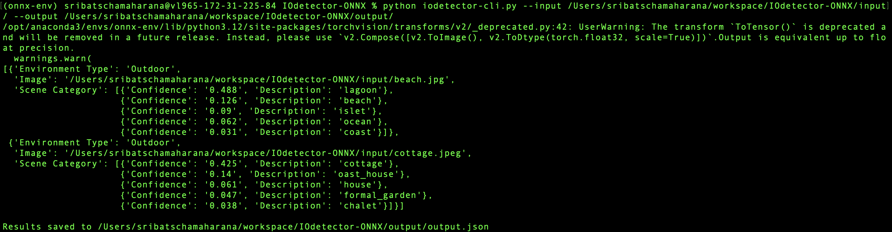

# IOdetector-ONNX

This repository contains an ONNX version of the Indoor/Outdoor scene classifier model, designed to work with the UMass RescueBox frontend. The model classifies images as either indoor or outdoor scenes and provides the top 5 scene categories.

## Steps to export the ONNX model

Exporting the ONNX model involves the following steps:
1. Clone and set up the UMass-Rescue/GeoLocator repo found [here](https://github.com/UMass-Rescue/GeoLocator). Follow instructions on README.md to get a dry run of the model working. (Note: an ```import torch``` command is missing in the flaskml-server.py script, required)
2. Configure [Rescue Box Desktop](https://github.com/UMass-Rescue/RescueBox-Desktop/releases) to work with the GeoLocator repo. To test that the application works, send an example request. There are some sample input images under the "input" folder from this (IOdetector-ONNX) repo. Once you get the GeoLocator model working, proceed to the next step. 
3. Set a breakpoint at Line 195, right before the `logit = model.forward(input_img)` call in the `run_iodetector` function in `IndoorOutdoorClassifier/iodetector.py` by adding the following line: `import pdb; pdb.set_trace()`.
4. Send a request to the GeoLocator backend again using the same inputs from the RescueBox Desktop application. The breakpoint will be triggered in the backend.
5. Run the following python code to export the ONNX model.
```
torch.onnx.export(
    model,              
    input_img,        
    "iodetector.onnx",   
    export_params=True, 
    opset_version=16,    
    do_constant_folding=True, 
    input_names=["input"],  
    output_names=["output"],   
    dynamic_axes={ "input": {0: "batch_size"},"output": {0: "batch_size"}}
)
```

The resulting ONNX model will be saved as "iodetector.onnx" in the directory where the `flaskml-server.py` exists.

## Installation, Setup and Usage

### 1. Clone the Repository:
```bash
git clone https://github.com/SribatschaMaharana/IOdetector-ONNX.git
cd IOdetector-ONNX
```

### 2. Set Up a Virtual Environment
Create a new virtual environment using any tool you prefer. For the first example, I use Conda, but you can also use `pipenv` or Python's `venv` as alternatives.

#### Option 1: Using Conda

If you prefer using **Conda**, create and activate your environment with:

```bash
conda create --name myenv python=3.12
conda activate myenv
```

#### Option 2: Using venv
```bash
python -m venv venv
source venv/bin/activate  # For Mac/Linux
venv\Scripts\activate  # For Windows
```

### 3. Install Dependencies
```bash
pip install -r requirements.txt
```

### 4. Run the backend server
To start the Flask-ML server:
```bash
python onnx-server.py
```
The server will run on http://127.0.0.1:5000 by default.

### 5. Run the IOdetector model

### Using the Frontend (RescueBox)
- Open the RescueBox interface.
- Register the model with the server's IP address (127.0.0.1) and port (5000).
- Upload images to the "Indoor/Outdoor Classifier - ONNX" model.
- Provide an input batch of files, or a input directory path. there are sample images in the repo (`~/IOdetector/input`).
- Provide an output JSON file path or directory (e.g., `~/IOdetector/output/output.json`).
- Click "Run Model" to process the images and retrieve the results.



### Using the Command line interface


```bash
# imagedir is the directory containing images to test
python iodetector-cli.py --input path/to/imagedir_or_file --output path/to/outputdir_or_output.json
```

There is a command line interface that can be used to run this model. The `--input` param can be either a directory containing images or specific image files, and the `--output` param can be either a directory or a specific output JSON file. 

```bash
# imagedir is the directory containing test images
python iodetector-cli.py --input path/to/imagedir_or_file --output path/to/outputdir_or_output.json
```

And there you have it!

### Output
The output is a JSON file containing:
- Indoor/Outdoor Classification: Information about the environment in which the image was captured, and the top 5 scene categories.

The original model, converted to ONNX format here, was based on the work described in the following paper:

```bibtex
 @article{zhou2017places,
    title={Places: A 10 million Image Database for Scene Recognition},
    author={Zhou, Bolei and Lapedriza, Agata and Khosla, Aditya and Oliva, Aude and Torralba, Antonio},
    journal={IEEE Transactions on Pattern Analysis and Machine Intelligence},
    year={2017},
    publisher={IEEE}
    }